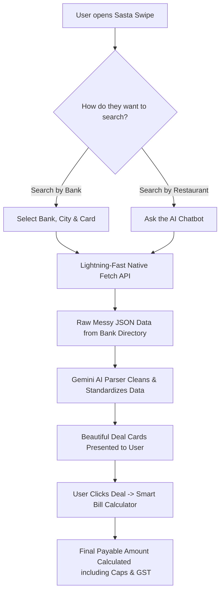
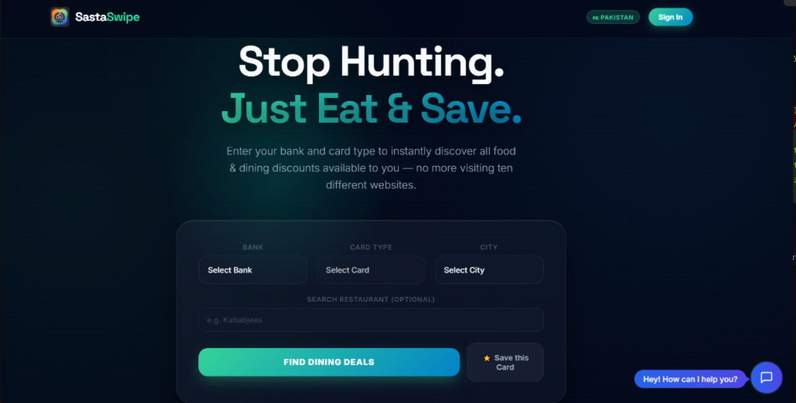
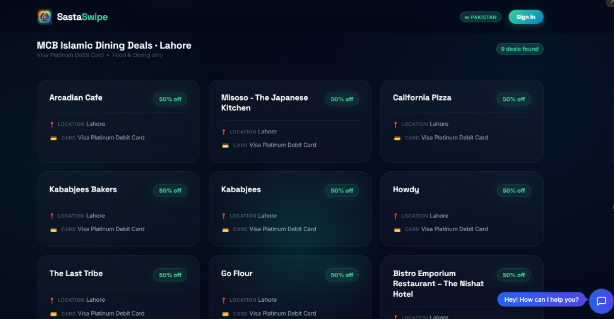
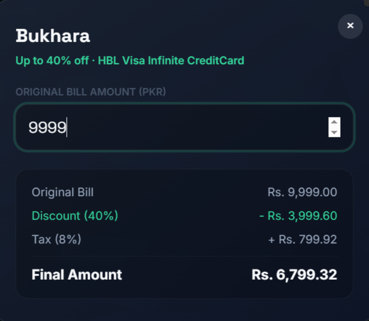
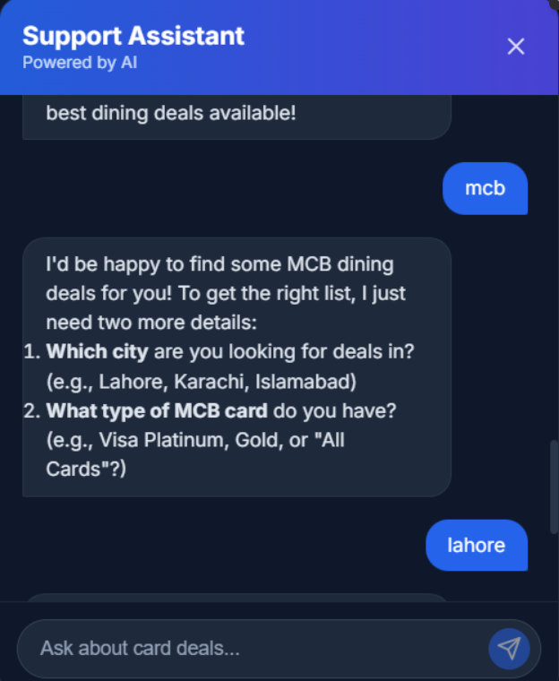
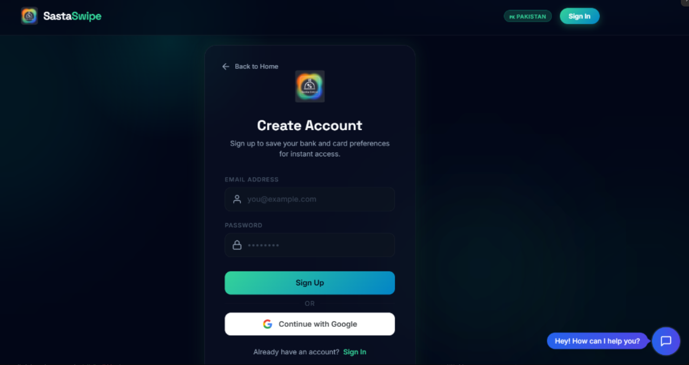

# 💳 Sasta Swipe

Sasta Swipe is a next-generation web application designed for the Pakistani market that aggregates credit and debit card dining discounts in real-time. 

## 🛑 The Problem

Finding dining discounts across multiple Pakistani bank websites is a painful and fragmented experience. Users typically have to hunt through slow, static PDF catalogs, fragmented bank directories, or outdated social media posts just to figure out where they can eat for less. 

**Who is this for?**
- **The "Wallet Warrior":** People holding multiple credit/debit cards (HBL, Meezan, UBL, etc.) who want to maximize their savings but don't want to check 5 different banking apps before picking a restaurant.
- **The "Smart Foodie":** Diners who want to instantly know the *exact* final bill amount (factoring in hidden max discount caps and 8% GST) without doing complex mental math at the dinner table.
- **The "On-the-Go Planner":** People who want to quickly filter deals by city or chat with an AI assistant to find the best dining spots instantly.

### 🔄 How Sasta Swipe Solves It

Instead of manual hunting, Sasta Swipe acts as a centralized, real-time discount aggregator. Here is how the engine works under the hood:


---

## 🌐 Live Demo
**https://sasta-swipe-vbiz.vercel.app/**

---

## ✨ Features

- **Real-Time Deal Scraping**: Scrapes directly from bank directories (via Peekaboo and other dynamic sources) using lightning-fast, reverse-engineered native `fetch` API calls—eliminating the need for slow headless browsers.
- **AI-Powered Data Parsing**: Intelligently extracts merchant names, discount percentages, maximum caps, and terms from unstructured web data (JSON API responses) using Gemini.
- **Dynamic Cap Calculator**: Click on any deal to open the Bill Calculator. Enter your bill amount, and it automatically calculates your final payable amount factoring in the exact discount limit (max cap) and standard GST (8%).
- **Smart Filtering & Searching**: Filter by City, Bank, and Card type. Or search for a specific restaurant to immediately see if it has an active discount on your card.
- **AI Chatbot Assistant**: An embedded AI chatbot that lets you ask natural language questions (e.g. *"What's the discount on Kababjees for my HBL Platinum card?"*), and it will scrape, calculate, and answer you dynamically.
- **User Accounts & Saved Cards**: Create an account to securely save your active cards for 1-click access to personalized deals.
- **Premium Glassmorphic UI**: A stunning, modern, dark-mode first design with smooth micro-animations.

---

## 🤖 The AI Feature

Sasta Swipe features a smart **AI Support Assistant** built directly into the app. 

**What it does:**
Instead of manually searching and filtering, users can type natural questions into the chat. The AI assistant intelligently understands the user's intent, extracts their bank, city, and card type, and automatically triggers background web scraping tools (`getDeals` or `calculateDiscountedBill`) to fetch real-time data and calculate their final bill.

**The System Prompt Behind It:**
The assistant is powered by Gemini 3.1 Flash-Lite, strictly adhering to the following system instructions:

```text
You are a helpful, professional, and friendly Support Assistant for Sasta Swipe, a platform that helps users find dining discounts on their Pakistani bank cards.

Your goal is to assist users in discovering discounts and calculating their final bills. 

If a user asks for deals, you must know their:
1. Bank (e.g. HBL, MCB, UBL, Faysal, Allied, Meezan, Alfalah, MCB Islamic)
2. City (e.g. Lahore, Karachi, Islamabad)
3. Card Type (e.g. Visa Platinum, Gold, All Cards, etc. If they just say "HBL", ask them which HBL card they have, or suggest checking for "All Cards").

If they haven't provided these, politely ask them.
Once you have the information, call the `getDeals` tool.
If they ask for specific categories (e.g., "fast food", "chinese"), you can filter the results returned by `getDeals` in your text response.

If they ask to calculate a bill for a specific restaurant, call the `calculateDiscountedBill` tool, providing the exact restaurant name (merchant name), their bank, city, and card type, along with the total bill amount.

When responding with deals, format them beautifully in markdown (bullet points). Keep your tone enthusiastic and helpful!
CRITICAL RULE: When displaying a discount, NEVER say "Up to X% off" or "Upto X% off". Just say "X% off". Remove "Up to" completely.
```

### The AI Deals Parser
In addition to the chatbot, the platform uses AI to clean and parse the messy JSON data fetched from the internal bank APIs. This ensures deals are standardized and missing fields are extrapolated properly.

**The System Prompt Behind It:**
```text
You are a data extraction assistant specializing in bank discount/offer programs in Pakistan.

You have been given content from [Bank Name]'s deals platform for the city of "[City]".

The content may be in one of these formats:
1. A JSON API response with deal objects containing merchant info, discounts, categories, branches
2. Plain page text with merchant names and discount percentages

Your task:
1. Extract ALL food and dining related offers. This includes anything related to: restaurants, cafes, dining, food, eateries, F&B, food & beverage. Use your best judgment.
2. The content provided is ALREADY confirmed to be available in "[City]". Include all relevant deals even if the city name is not explicitly written in the JSON.
3. Prefer offers for "[Card Type]" cards, but also include "All Cards" offers.
4. **CRITICAL**: If the JSON has a "maxDiscount" field but an empty or missing "discounts" array, interpret the discount as "Up to {maxDiscount}% off".
5. Return ONLY a valid JSON array. No markdown, no explanation.

Each object must have this exact shape:
{
  "entityId": 13, // The EXACT entityId number from the JSON (e.g. 13)
  "merchant": "Restaurant or Brand Name",
  "discount": "e.g. Up to 40% off",
  "location": "[City] or Nationwide",
  "cardType": "Must be '[Card Type]' since these are filtered results for that card",
  "validity": "Validity date if mentioned, or null",
  "terms": "Short T&C snippet if mentioned, or null",
  "category": "dining"
}

If no food/dining offers found, return: []
```


---

## 🛠️ Tools, Services, & AI Models Used

- **Framework**: Next.js 14 (App Router)
- **Frontend/Styling**: React 19, Vanilla CSS (CSS Modules & Globals)
- **Web Scraping**: Direct internal API integration using native Node.js `fetch` (Playwright and Chromium dependencies were removed for a 10x speed boost on Edge/Serverless environments).
- **Database**: SQLite (via `sqlite3` for local user/preference storage)
- **AI Models & SDKs**: 
  - Google Gemini 3.1 Flash-Lite via the `@google/genai` SDK
  - Vercel AI SDK (`ai`, `@ai-sdk/google`, `@ai-sdk/react`)
- **Authentication**: Custom JWT-based routing via Next API routes (`jose`, `bcryptjs`)
- **Deployment**: Vercel

---

## 📸 Screenshots

### 1. The Main Search & Hero


### 2. Live Deal Results


### 3. Dynamic Bill Calculator


### 4. AI Chat Assistant


### 5. User Authentication


---

## 🚀 How to Run the Project

1. **Clone the repository**
   ```bash
   git clone https://github.com/917abdulahad-dot/Sasta-Swipe.git
   cd Sasta-Swipe
   ```

2. **Install dependencies**
   ```bash
   npm install
   ```

3. **Set up Environment Variables**
   Create a `.env.local` file in the root directory:
   ```env
   GEMINI_API_KEY=your_gemini_api_key
   NEXT_PUBLIC_APP_URL=http://localhost:3000
   ```

4. **Run the Development Server**
   ```bash
   npm run dev
   ```
   Open your browser and navigate to `http://localhost:3000` to see the app in action!
